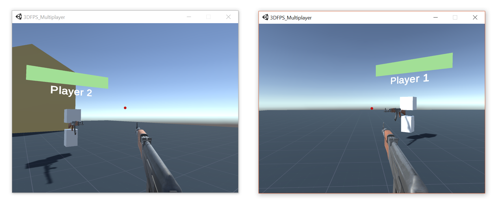

# 3D FPS Multiplayer Demo
The project is created for advancing skills in multiplayer connection with Unity Games using Photon Cloud Application.
The design of a game is based on basic First Person Shooter idea with minimum effort on appearance and focus on networking 
and connection via server.

## Screenshots

## How to use?
As this is not a game, installation files will not be provided. You can use this project as a template or demo example for 
Multiplayer games in Unity based on Photon Cloud Application.
- Clone the repository.
- Import it to Unity Engine. (Add from Unity Hub)
You might need to create an account in Photon and connect to your own server which is free up to 20 CCU (Concurrently Connected Users).
For that visit [Photon](https://www.photonengine.com/en-US/Photon) and register. You can find Photon's documentation here --> [Documentation](https://doc.photonengine.com/en-us/realtime/current/getting-started/realtime-intro). Many different Youtube tutorials and courses are also available.

## Demo Game Keyboards
- WASD and Arrows for movement
- Left Click of Mouse for Shooting

## Contacts 
- E-mail address orkhan.elchuev@gmail.com
- https://github.com/OrkhanElchuev/3DFPS-Multiplayer-Demo

## Aknowledgements
- [Devassets](http://devassets.com) For weapon package.
